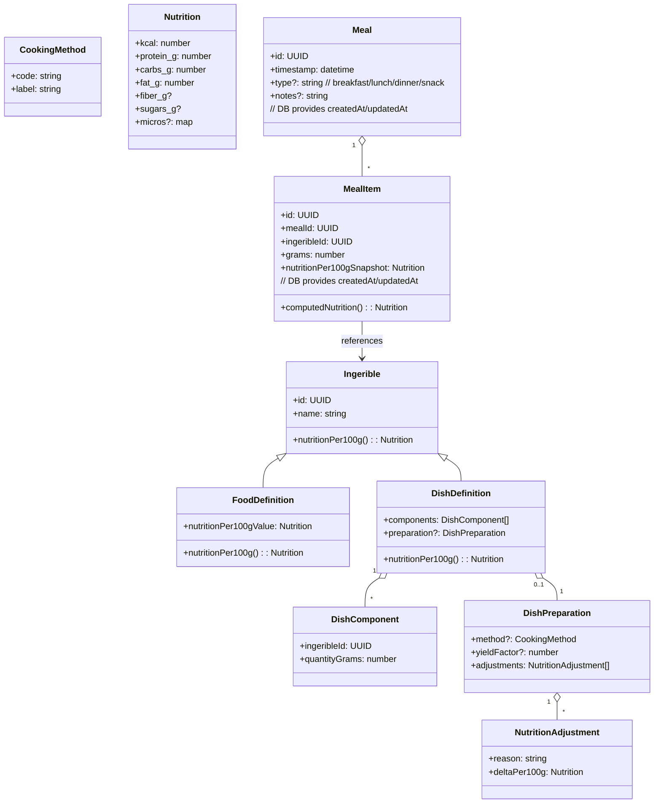

# Ingesta – Domain Model

## Food & Intake Domain

### Mermaid Live

- https://mermaid.live
- Copy & Paste diagram
- Chose Sequence Sample Diagram
- Export to image if needed

> Ingerible represents anything that can be consumed and has a calculable nutritional value.

> Both FoodDefinition and DishDefinition are ingeribles.

---

## Reglas de dominio e invariantes

### 1) Qué es un Ingerible

Un **Ingerible** es cualquier cosa que puede consumirse y cuya nutrición puede calcularse por 100g.

Tipos:
- `FoodDefinition` → alimento atómico - no tiene componentes ni preparación.
- `DishDefinition` → preparación cocinada conjuntamente compuesta por 1..n componentes (`DishComponent`).
Puede ser tan simple como: `FoodDefinition (arroz crudo) + preparación (hervido)`, ya que esto aporta un `yield` de peso por agua al arroz crudo.

---

### 2) Reglas de composición de DishDefinition

Un `DishDefinition` representa una preparación cocinada conjuntamente.

Puede contener como componentes:
- `FoodDefinition`
- `DishDefinition` (subpreparaciones)

#### 2.1) Regla anti-ciclos (obligatoria)

El grafo de composición de `DishDefinition` debe ser **acíclico**.

Un `DishDefinition` **NO** puede incluirse a sí mismo:
- Directamente
- Indirectamente (a través de otros `DishDefinition`)

Ejemplo inválido:
- A incluye B
- B incluye A
- se lanza un error de dominio `DishCycleDetected`.

Esto garantiza que el cálculo nutricional siempre termina.

---

### 3) Regla de límite de complejidad (guardarraíl)

Para garantizar estabilidad y rendimiento en entorno móvil offline-first:

Durante el cálculo de `nutritionPer100g()`:

- Se cuenta el número de ingeribles visitados (Food o Dish).
- Se aplica un máximo configurable (`MAX_NODES`).

Si se supera el límite:
- se lanza un error de dominio `DishTooComplex`.

Aclaraciones:
- “Nodo visitado” = cada `Ingerible` resuelto durante el cálculo (Food o Dish).
- Cada vez que el algoritmo resuelve un ingerible, incrementa el contador.

Esto evita recorridos recursivos excesivos y protege el rendimiento.

---

### 4) Semántica de Meal y MealItem

Un `Meal` representa una ocasión de consumo (desayuno, comida, etc.).

Un `MealItem` representa un ingerible consumido dentro de ese `Meal`, junto con su cantidad en gramos.

Importante:

Si varios elementos no han sido cocinados conjuntamente, **no** deben formar un nuevo `DishDefinition`.
Deben representarse como varios `MealItem` dentro del mismo `Meal`.

Ejemplo correcto:
- Meal:
  - Lasaña 250g
  - Ensalada 150g
  - Pan 60g

(No es un `DishDefinition` nuevo.)

---

### 5) Regla de snapshot (consistencia histórica)

Al crear un `MealItem`:

- se debe guardar un snapshot `nutritionPer100gSnapshot`.
- cambios posteriores en `FoodDefinition` o `DishDefinition` no deben alterar comidas históricas.

Esto garantiza consistencia histórica.

---

### 6) Orden conceptual del cálculo nutricional en DishDefinition

Para un `DishDefinition`:

1. Resolver la nutrición de cada componente.
2. Multiplicar por los gramos del componente.
3. Sumar nutrición total.
4. Aplicar `yieldFactor` si existe.
5. Aplicar `NutritionAdjustment` si existe.
6. Normalizar el resultado a 100g.

El cálculo puede fallar si:
- se detecta un ciclo.
- se supera el límite de complejidad.

---

### 7) Convenciones nutricionales

- Todas las magnitudes nutricionales se expresan por 100g.
- Energía en kcal.
- Macronutrientes en gramos.
- El dominio trabaja con precisión decimal.
- El redondeo es responsabilidad de la capa de presentación (UI).

---

### 8) Consideraciones de evolución futura (Backend)

En Fase 1 (offline-first), el dominio y los casos de uso se implementan en TypeScript dentro de la aplicación móvil.

Esta implementación actúa como **implementación de referencia** del modelo de dominio.

En caso de incorporar un backend en el futuro (incluso en otro lenguaje como PHP/Laravel):

- Las reglas definidas en este documento se consideran la **especificación funcional oficial del dominio**.
- El backend deberá replicar estas reglas e invariantes.
- El contrato entre frontend y backend se definirá mediante DTOs y especificaciones formales (por ejemplo, OpenAPI).
- El frontend no dependerá directamente de la infraestructura concreta (local o remota), sino de casos de uso definidos en la capa de aplicación.

El objetivo es permitir la incorporación de backend sin refactor masivo en la capa de UI ni en la definición conceptual del dominio.
